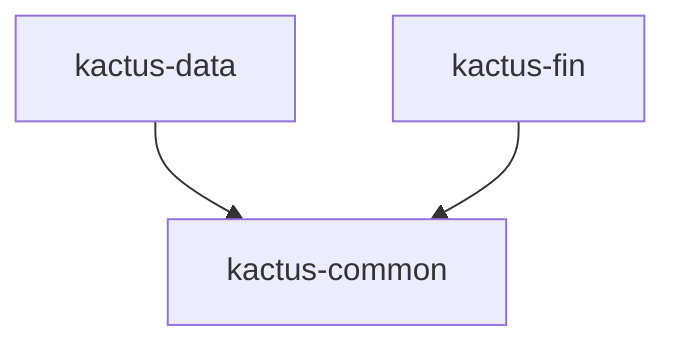

# 🌵 Kactus

A Python monorepo for financial data collection, processing, and serving — powered by [uv workspaces](https://docs.astral.sh/uv/concepts/workspaces/).

## Architecture

```
kactus/
├── packages/
│   ├── kactus-common/   # Shared library (DuckDB, Pydantic schemas)
│   ├── kactus-data/     # Data scraping & ETL pipelines
│   └── kactus-fin/      # FastAPI backend server
```

| Package | Description | Key Dependencies |
|---------|-------------|-----------------|
| [**kactus-common**](packages/kactus-common/) | Shared utilities: DuckDB client, data models, constants | `duckdb`, `pandas`, `pydantic` |
| [**kactus-data**](packages/kactus-data/) | Data sources, schemas, scraping, collection, ETL jobs | `kactus-common`, `requests` |
| [**kactus-fin**](packages/kactus-fin/) | REST API for financial data | `kactus-common`, `fastapi`, `uvicorn` |

### Dependency Graph



## Prerequisites

- **Python** ≥ 3.12
- **[uv](https://docs.astral.sh/uv/getting-started/installation/)** (fast Python package manager)

## Quick Start

```bash
# Clone the repo
git clone <your-repo-url> && cd kactus

# Install all packages in the workspace
uv sync --all-packages

# Run tests
uv run pytest

# Start the API server
uv run uvicorn kactus_fin.app:app --reload
```

## Development

### Install & Sync

```bash
# Install all workspace packages (editable)
uv sync --all-packages

# Install only a specific package and its deps
uv sync --package kactus-common
```

### Running Tests

```bash
# All tests
uv run pytest

# Specific package tests
uv run pytest packages/kactus-common/tests/ -v
uv run pytest packages/kactus-data/tests/ -v

# With coverage (if installed)
uv run pytest --cov
```

### Adding Dependencies

```bash
# Add a dependency to a specific package
cd packages/kactus-data
uv add httpx

# Add a dev dependency to the root
uv add --dev ruff
```

### Running the API Server

```bash
# Development (with hot reload)
uv run uvicorn kactus_fin.app:app --reload --port 8000

# Check health
curl http://localhost:8000/health
# → {"status": "ok"}
```

### Code Quality

```bash
# Format (if ruff is installed)
uv run ruff format .

# Lint
uv run ruff check .
```

## Project Configuration

| File | Purpose |
|------|---------|
| `pyproject.toml` | Root workspace config, shared dev dependencies |
| `pytest.ini` | Test runner configuration |
| `.python-version` | Python version pin (3.12) |
| `packages/*/pyproject.toml` | Per-package dependencies and build config |

## Environment Variables

The **kactus-fin** server supports configuration via environment variables (prefixed with `KACTUS_`):

| Variable | Default | Description |
|----------|---------|-------------|
| `KACTUS_DEBUG` | `false` | Enable debug mode |
| `KACTUS_HOST` | `0.0.0.0` | Server bind host |
| `KACTUS_PORT` | `8000` | Server bind port |
| `KACTUS_DB_PATH` | `kactus.duckdb` | Path to DuckDB database file |

You can also use a `.env` file in the project root.

## License

Private — All rights reserved.
