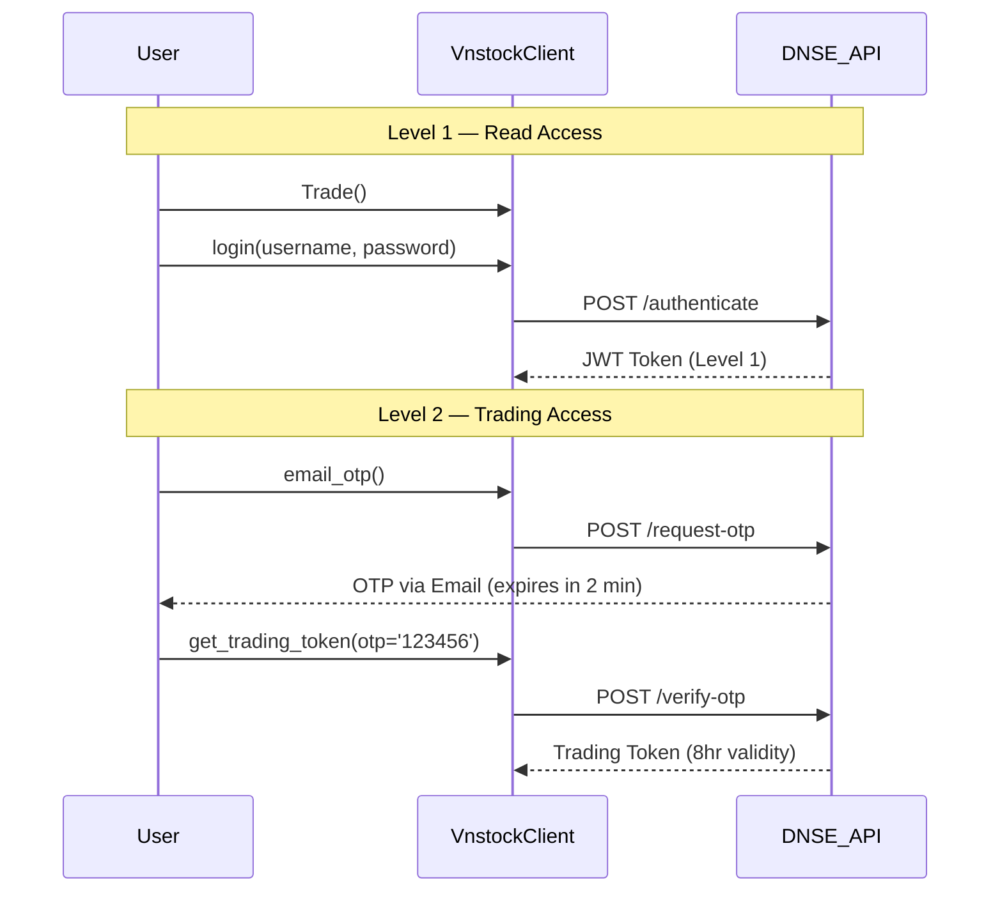

# Authentication & Authorization

> VNStock supports two authentication modes: **API Key** (for data access rate limits) and **DNSE Trading API** (for order execution).

---

## 1. API Key — Data Access Tiers

The vnstock library itself does **NOT** require authentication for basic data access. An API key only upgrades your rate limit. Data is sourced from public broker APIs (KBS, VCI).

| Tier | Rate Limit | How to Get |
|------|------------|------------|
| **Anonymous** | 20 requests/min | No login needed |
| **Free (Google login)** | 60 requests/min | Login at [vnstocks.com/login](https://vnstocks.com/login) with Google |
| **Insider (paid)** | 180–500 requests/min | Join [Vnstock Insiders Program](https://vnstocks.com/insiders-program) |

### Usage

No special code is required for anonymous access. For authenticated access, configure your API key as described in the vnstock documentation.

---

## 2. DNSE Trading API — Order Execution

For **placing orders** (not data collection), VNStock integrates with DNSE broker. This requires a **DNSE trading account**.

### 2.1 Authentication Levels

| Auth Level | Purpose | Token Type | Validity |
|------------|---------|------------|----------|
| **Level 1** | Read account info | JWT Token | Session |
| **Level 2** | Place / modify / cancel orders | Trading Token | 8 hours |

### 2.2 Authentication Flow



### 2.3 Code Example

```python
from vnstock.connector.dnse import Trade

# Level 1: Login
client = Trade()
client.login("YOUR_USERNAME", "YOUR_PASSWORD")  # → JWT Token

# Level 2: Request OTP and get trading token
client.email_otp()  # Request OTP via email
trading_token = client.get_trading_token(otp='123456', smart_otp=False)
```

> **Note:** OTP via email expires in **2 minutes**. SmartOTP from EntradeX app is the default. For full automation, use Gmail API to extract email OTP programmatically.

---

## 3. Proxy Configuration

For environments where broker APIs are blocked (Google Colab, Kaggle, etc.):

```python
from vnstock import ProxyManager

proxy_mgr = ProxyManager()
proxy_list = proxy_mgr.get_proxy_list()

# Auto-select best proxy
best_proxy = proxy_mgr.get_best_proxy()

# Use with data classes
finance = Finance(
    source="KBS",
    symbol="VCI",
    proxy_mode="auto",
    proxy_list=proxy_list
)
```
