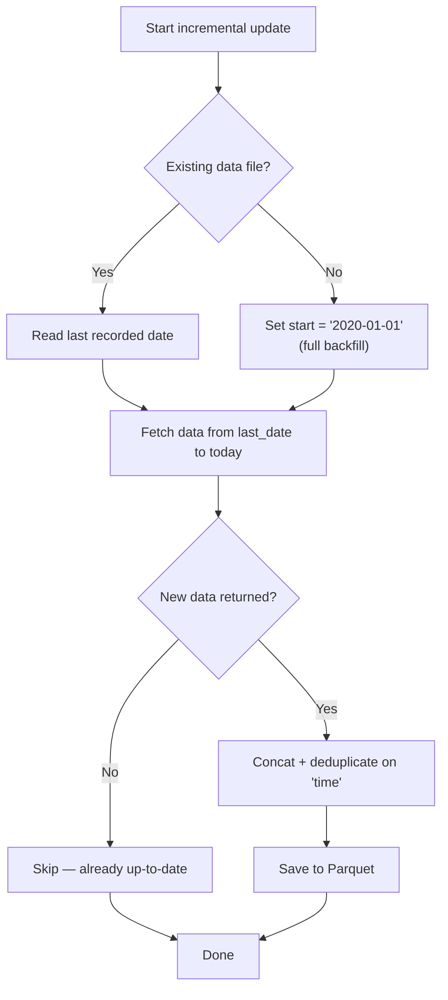

# Backfill Strategies

> Patterns for initial bulk data loading and ongoing incremental updates.

---

## 1. Single Stock Backfill

Use `start` and `end` parameters to fetch the full historical range.

```python
from vnstock import Quote

quote = Quote(symbol='VCI', source='VCI')

# Backfill 5 years of daily data
df = quote.history(start='2019-01-01', end='2024-12-31', interval='1D')
df.to_parquet('backfill_VCI_daily.parquet')

# Backfill hourly data for 1 year
df_hourly = quote.history(start='2024-01-01', end='2024-12-31', interval='1H')
df_hourly.to_parquet('backfill_VCI_hourly.parquet')
```

---

## 2. Multi-Stock Backfill — Sequential

Simple loop with rate limiting. Reliable but slow.

```python
from vnstock import Listing, Quote
import time

listing = Listing(source='KBS')
all_symbols = listing.all_symbols()['symbol'].tolist()

for symbol in all_symbols:
    try:
        quote = Quote(symbol=symbol, source='KBS')
        df = quote.history(start='2020-01-01', end='2024-12-31', interval='1D')
        df.to_parquet(f'data/{symbol}_daily.parquet')
        print(f"✅ {symbol}: {len(df)} rows")
    except Exception as e:
        print(f"❌ {symbol}: {e}")

    time.sleep(1)  # Respect rate limit (60 req/min max)
```

---

## 3. Multi-Stock Backfill — Parallel

Use thread pool for faster execution while respecting rate limits.

```python
from vnstock import Listing, Quote
from concurrent.futures import ThreadPoolExecutor, as_completed
import time

listing = Listing(source='KBS')
symbols = listing.all_symbols()['symbol'].tolist()

def fetch_stock(symbol):
    try:
        quote = Quote(symbol=symbol, source='KBS')
        df = quote.history(start='2020-01-01', end='2024-12-31', interval='1D')
        df.to_parquet(f'data/{symbol}_daily.parquet')
        return symbol, len(df), None
    except Exception as e:
        return symbol, 0, str(e)

# Use 3 workers to stay within 60 req/min
with ThreadPoolExecutor(max_workers=3) as executor:
    futures = {}
    for i, symbol in enumerate(symbols):
        futures[executor.submit(fetch_stock, symbol)] = symbol
        if (i + 1) % 3 == 0:
            time.sleep(1)  # Batch delay

    for future in as_completed(futures):
        symbol, count, error = future.result()
        if error:
            print(f"❌ {symbol}: {error}")
        else:
            print(f"✅ {symbol}: {count} rows")
```

### Performance Estimates (~1,500 stocks)

| Tier | Rate Limit | Estimated Time |
|------|------------|----------------|
| **Anonymous** | 20 req/min | ~75 minutes |
| **Free** | 60 req/min | ~25 minutes |
| **Insider** | 500 req/min | ~3 minutes |

---

## 4. Incremental Daily Updates

After initial backfill, only fetch new data since the last recorded date.

```python
from vnstock import Quote
from datetime import date
import pandas as pd

def incremental_update(symbol, data_dir='data'):
    filepath = f'{data_dir}/{symbol}_daily.parquet'

    try:
        existing = pd.read_parquet(filepath)
        last_date = existing['time'].max().strftime('%Y-%m-%d')
    except FileNotFoundError:
        last_date = '2020-01-01'  # Triggers full backfill

    quote = Quote(symbol=symbol, source='KBS')
    new_data = quote.history(
        start=last_date,
        end=date.today().strftime('%Y-%m-%d'),
        interval='1D'
    )

    if not new_data.empty:
        combined = pd.concat([existing, new_data]).drop_duplicates(subset='time')
        combined.to_parquet(filepath, index=False)

    return len(new_data)
```

### How It Works



---

## 5. Best Practices

| Practice | Recommendation |
|----------|----------------|
| **Storage format** | Parquet for compression & fast reads; DB for querying |
| **Deduplication** | Always deduplicate on `time` column after concat |
| **Error handling** | Log failed symbols and retry in a separate pass |
| **Rate limiting** | Always `time.sleep()` between requests — never burst |
| **Monitoring** | Log success/fail counts and total rows ingested |
| **Idempotency** | Use upsert logic (deduplicate) so re-runs are safe |
