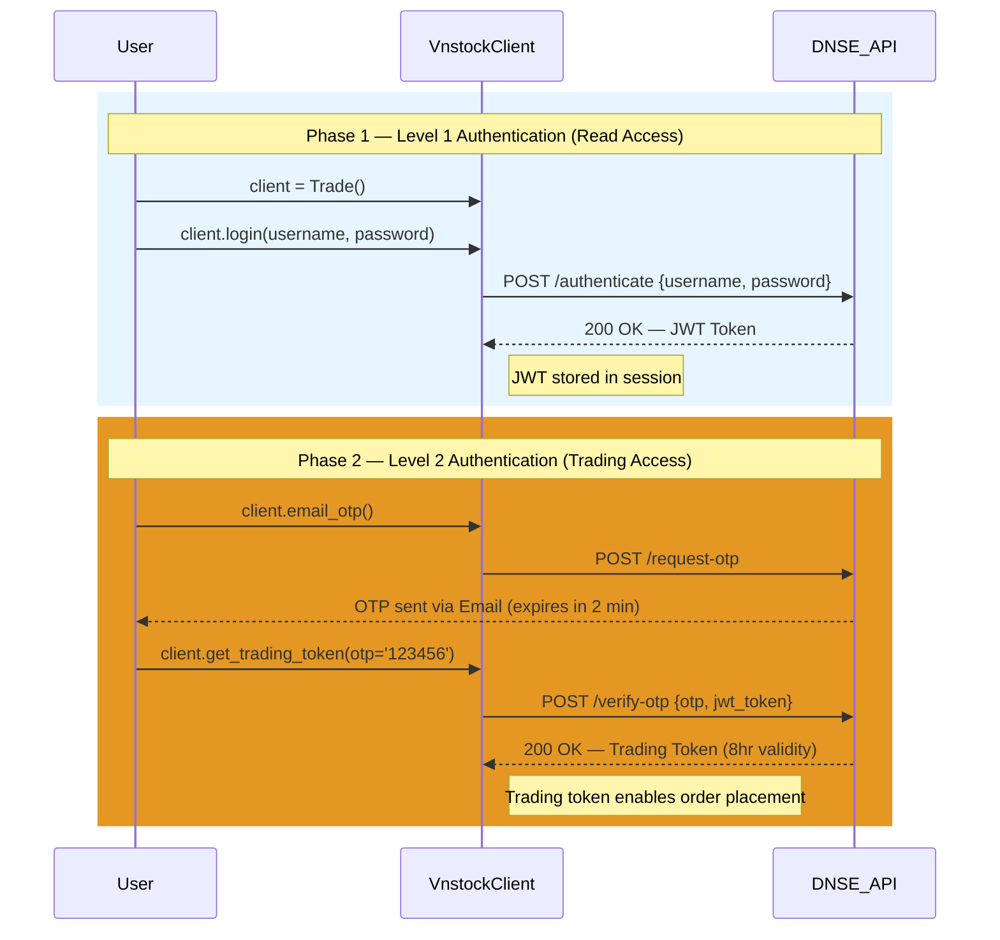
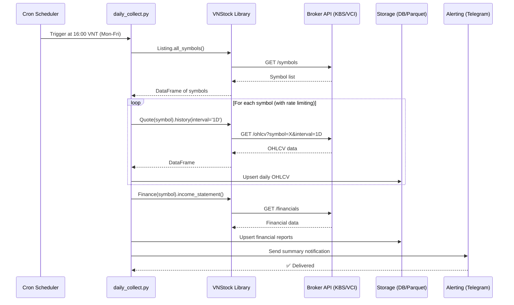
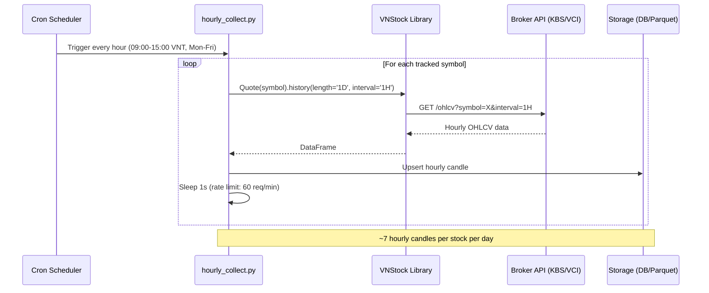
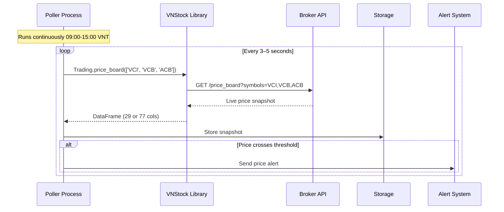
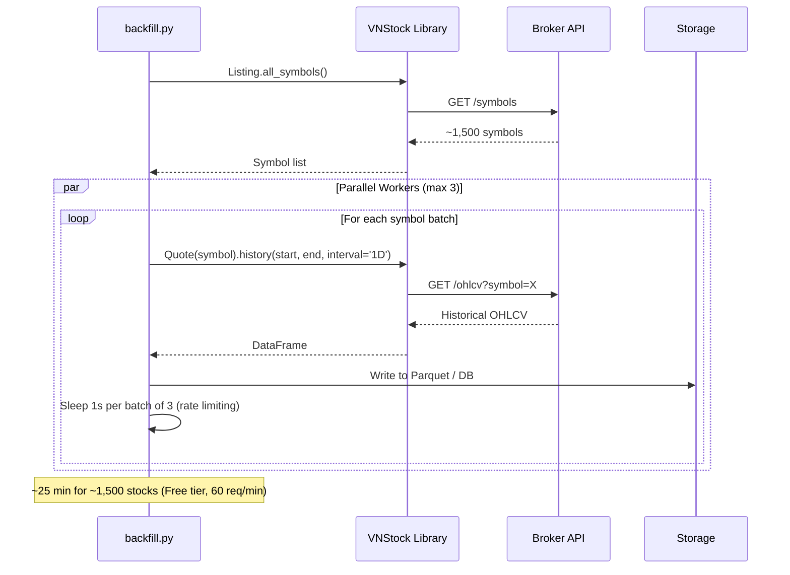
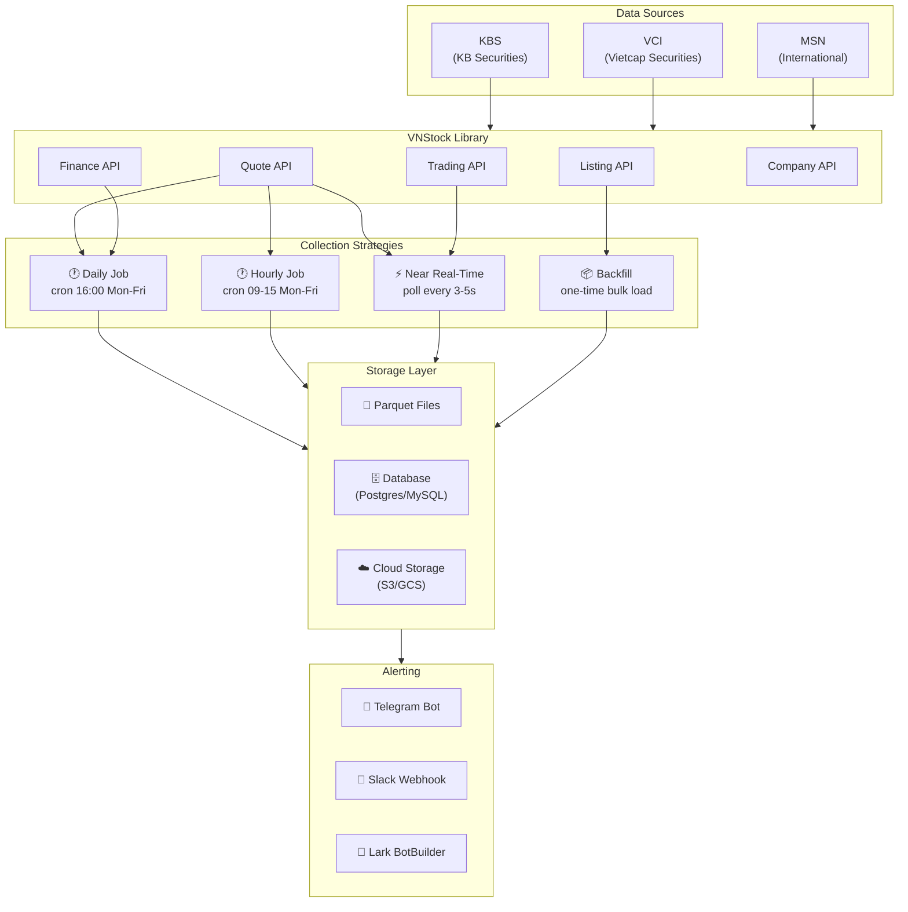

# Sequence Diagrams & Architecture

> Visual diagrams for authentication flows, data collection pipelines, and system architecture.

---

## 1. DNSE Trading Authentication Flow

Two-phase authentication: Level 1 (read-only JWT) and Level 2 (trading token via OTP).

---

## 2. Daily Data Collection Flow

Scheduled at **16:00 VNT (Vietnam Time)** after market close (15:00 VNT). Runs Monday–Friday only.

---

## 3. Hourly Data Collection Flow

Runs every hour during market hours (**09:00–15:00 VNT**), Monday–Friday.

---

## 4. Near Real-Time Polling Flow

Continuous polling during market hours for live price updates, using `price_board()` (multi-symbol) or `intraday()` (single-symbol).

---

## 5. Backfill Flow

One-time (or periodic) bulk historical data download with rate limiting.

---

## 6. System Architecture — Data Pipeline Overview

---

## 7. Cron Job Schedule Overview

```mermaid
gantt
    title VNStock Data Collection Schedule (Vietnam Time, Mon-Fri)
    dateFormat HH:mm
    axisFormat %H:%M

    section Market Hours
    Market Open           :active,    09:00, 15:00

    section Hourly Collection
    Hour 09               :           09:00, 10:00
    Hour 10               :           10:00, 11:00
    Hour 11               :           11:00, 12:00
    Hour 12               :           12:00, 13:00
    Hour 13               :           13:00, 14:00
    Hour 14               :           14:00, 15:00

    section Real-Time Polling
    Continuous Polling     :active,    09:00, 15:00

    section Daily Collection
    Daily Job              :crit,      16:00, 17:00

    section Weekly/Monthly
    Weekly Report (Sat)    :           09:00, 10:00
    Monthly Report (1st)   :           09:00, 10:00
```

